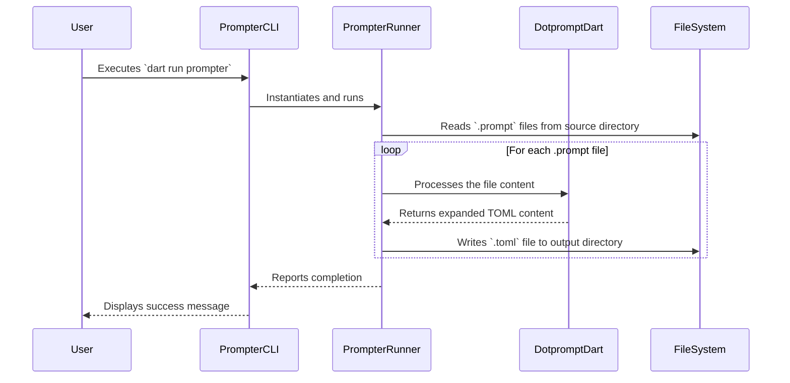

# Prompter Design Document

## 1. Overview

This document outlines the design for a command-line tool named `prompter`. The purpose of this tool is to automate the generation of `.toml` files from `.prompt` source files. These `.toml` files are used as command configurations within the Gemini CLI extension. The `prompter` tool will leverage the `dotprompt_dart` library to process the `.prompt` files, performing necessary substitutions and inserting partials to generate the final `.toml` content.

The tool will be located in the `scripts/prompter` directory of the `gemini-cli-extension` repository and will be used as part of the build process to ensure that the `.toml` command files are always up-to-date with their `.prompt` sources.

## 2. Goal Analysis

The primary goal of the `prompter` tool is to streamline the management of command prompts for the Gemini CLI extension. Currently, the prompts are embedded directly within `.toml` files. This makes them difficult to maintain, reuse, and update, especially as the number of commands and the complexity of the prompts grow.

By separating the prompt templates into `.prompt` files, we can:

-   **Improve Reusability**: Common prompt sections can be extracted into partials and reused across multiple prompts.
-   **Enhance Readability**: `.prompt` files, with their Handlebars syntax, are more readable and focused on the prompt content itself.
-   **Simplify Maintenance**: Changes to prompts can be made in a single place, and the `.toml` files can be regenerated automatically.
-   **Enable Version Control**: `.prompt` files can be version-controlled, making it easier to track changes to prompts over time.

The `prompter` tool will address these needs by providing a simple and efficient way to compile `.prompt` files into the `.toml` format expected by the Gemini CLI extension.

## 3. Alternatives Considered

### 3.1. Manual `.toml` File Management

This is the current approach, where the `.toml` files are created and edited manually.

-   **Pros**: No additional tools or build steps are required.
-   **Cons**: Prone to errors, difficult to maintain, and does not scale well as the number of commands increases. It also makes it harder to reuse prompt components.

### 3.2. Custom Scripting (without `dotprompt_dart`)

A custom script could be written to perform simple text substitutions.

-   **Pros**: No external dependencies are needed.
-   **Cons**: This would require reinventing the wheel and would likely not be as robust or feature-rich as the `dotprompt` format. It would also not benefit from the standardization that `dotprompt` provides.

### 3.3. Using a Different Templating Engine

Other templating engines, such as Mustache or Liquid, could be used.

-   **Pros**: These are mature and well-supported templating languages.
-   **Cons**: They are not specifically designed for GenAI prompts and lack the features of `dotprompt`, such as built-in support for model configuration and input/output schemas.

The chosen approach of using the `dotprompt_dart` library is the most suitable because it is specifically designed for this purpose and provides a standardized, feature-rich solution.

## 4. Detailed Design

The `prompter` tool will be a command-line application written in Dart. It will be responsible for finding all `.prompt` files in a specified source directory, processing each file, and writing the output to a corresponding `.toml` file in a destination directory.

### 4.1. File Structure

The `prompter` package will have the following structure:

```
scripts/prompter/
├── bin/
│   └── prompter.dart
├── lib/
│   └── src/
│       └── prompter_runner.dart
├── pubspec.yaml
├── README.md
├── DESIGN.md
└── IMPLEMENTATION.md
```

### 4.2. Command-Line Interface

The tool will be executed from the command line and will accept the following arguments:

-   `--source`: The directory containing the `.prompt` files. Defaults to `prompts/`.
-   `--output`: The directory where the `.toml` files will be generated. Defaults to `commands/`.
-   `--watch`: A flag to enable watch mode, where the tool will continuously monitor the source directory for changes and regenerate the `.toml` files automatically.

### 4.3. Core Logic

**Note on Partials**: Upon inspection of the `dotprompt_dart` library, it has been determined that the current version does not support Handlebars partials. Therefore, the initial version of the `prompter` tool will not support them either. This could be considered as a future enhancement, potentially by contributing to the `dotprompt_dart` library.

The core logic of the `prompter` tool will be implemented in the `PrompterRunner` class. This class will be responsible for:

1.  **Parsing Command-Line Arguments**: Using the `args` package to parse the command-line arguments.
2.  **Finding `.prompt` Files**: Scanning the source directory for files with the `.prompt` extension.
3.  **Processing Each `.prompt` File**: For each `.prompt` file, the tool will:
    a.  Read the content of the file.
    b.  Use the `dotprompt_dart` library to parse the file and perform any necessary substitutions and partial insertions.
    c.  Generate the final `.toml` content, including a header comment indicating that the file is auto-generated.
4.  **Writing `.toml` Files**: Write the generated content to a `.toml` file with the same name as the `.prompt` file (but with a `.toml` extension) in the output directory.

### 4.4. Diagram

Here is a sequence diagram illustrating the process:



## 5. Summary

The `prompter` tool will be a valuable addition to the `gemini-cli-extension` repository. It will improve the maintainability, reusability, and readability of the command prompts by leveraging the `dotprompt` format and the `dotprompt_dart` library. The tool will be a simple, yet powerful, command-line application that will be integrated into the build process to automate the generation of `.toml` files.

## 6. Research URLs

-   [dotprompt README](https://raw.githubusercontent.com/google/dotprompt/refs/heads/main/README.md)
-   [dotprompt_dart README](https://raw.githubusercontent.com/csells/dotprompt_dart/refs/heads/main/README.md)
